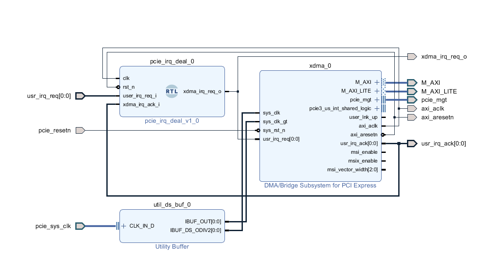
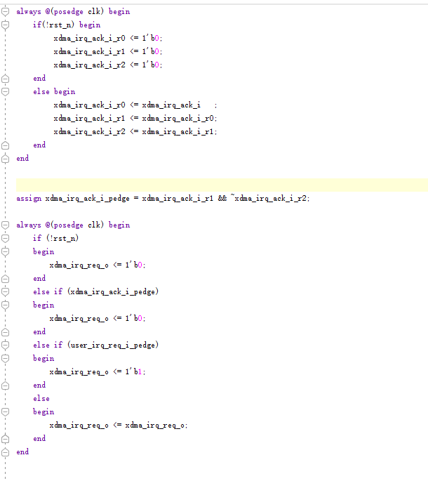
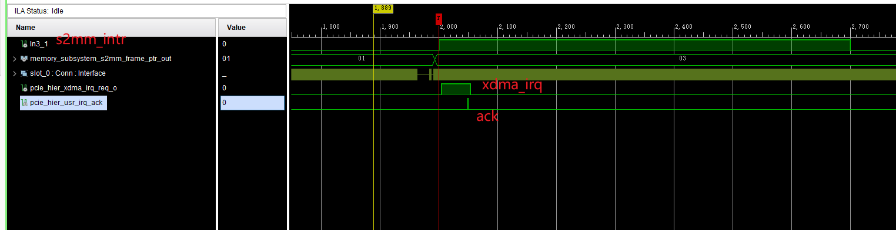
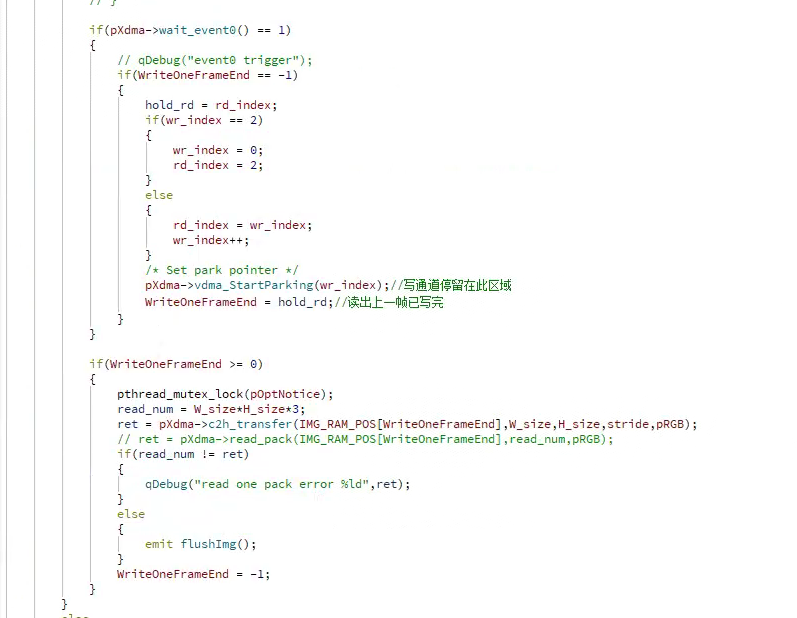

# microblaze 最小系统

mb时钟来自clk_wiz, 有dc有ic，通过axi_interconnect访问mig7, ddr4速率配置为2400Mbps(clk1200M),

for XCKU040-2FFVA1156I(xcku040-ffva1156-2-i)

ddr4 (MT40A512M16LY-062E) 颗粒本身 3200Mbps

vivado 里 Momory Part 选择”MT40A512M16HA-083E” 跑在 2400 Mbps, ref to AXU7EV course s1

# block design

[doc/system.pdf](doc/system.pdf)

# MicroBlaze 最小系统

# Jtag模式

可以选上 program fpga

也可以不选，先下载bitstream，再debug

# PCIE中断

将vdma的s2mm中断接到xdma的中断输入口，通过上位机检测不到pcie侧的中断发生，推测vdma的中断脉冲持续时间太短，对pcie上位机侧监测到高电平即为中断发生

根据中断脉冲与xdma的中断ack进行握手，当收到中断脉冲持续拉高中断输入，直到收到ack才拉低中断输入

根据上位机显示效果良好，通过vdma的parkin模式，三帧缓存，读完完整一帧进行切换

